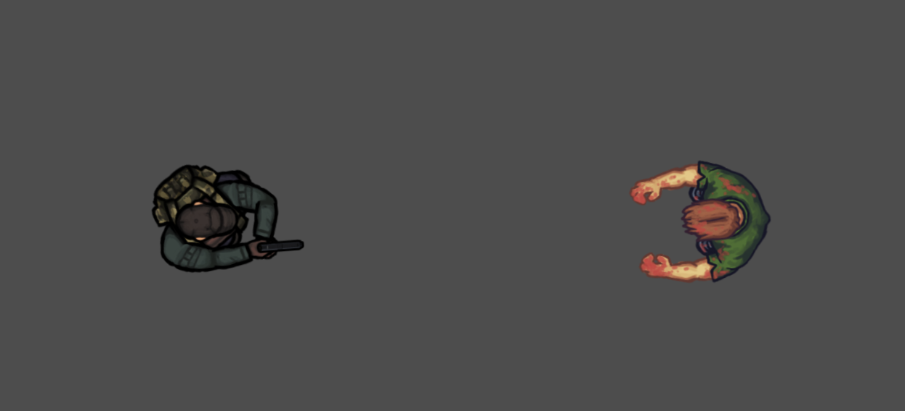

# Thermal Hunter

Therma Hunter is a top-down view FPS game developed in Godot Engine. The game features a unique thermal mechanic where players and weapons generate heat, which can be detected by enemies.

## Player

- Look and rotate with arrow keys `Up`, `Down`, `Left` and `Right`.
- Move with `W`, `A`, `S`, `D` OR `Z`, `Q`, `S`, `D`.
- Sprint to move faster but generate more heat, using `Shift`.
- Shoot with `Space`.
- Reload your weapon with `R`.
- Activate a thermal view to detect heat sources, using `Tab`.

## Weapons

- Fight with a variety of weapons, including a **9mm pistol**, a **shotgun**, and an **AK47**.
- Each weapon generates heat when fired, with the shotgun and AK47 generating more heat than the 9mm.

## Monsters

- The monsters in Therma Hunter are blind, but they can feel the heat.
- Monsters are attracted to heat sources, including the player's body heat and the heat generated by weapons.

## Thermal Discretion

- Manage your heat levels to avoid detection by monsters.
- Use the environment and your weapons strategically to distract monsters and escape.

## Screenshots

2 September 2024

<!--  -->

## Usage

You can play the game by opening the project in Godot Engine. The goal is to kill the monsters without being killed yourself, using your weapons and thermal discretion to survive.
